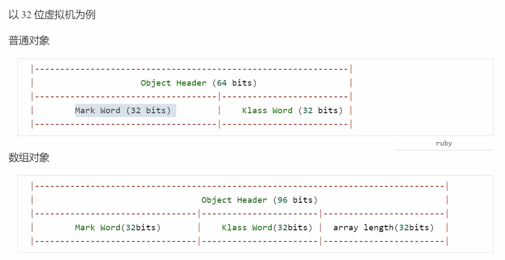
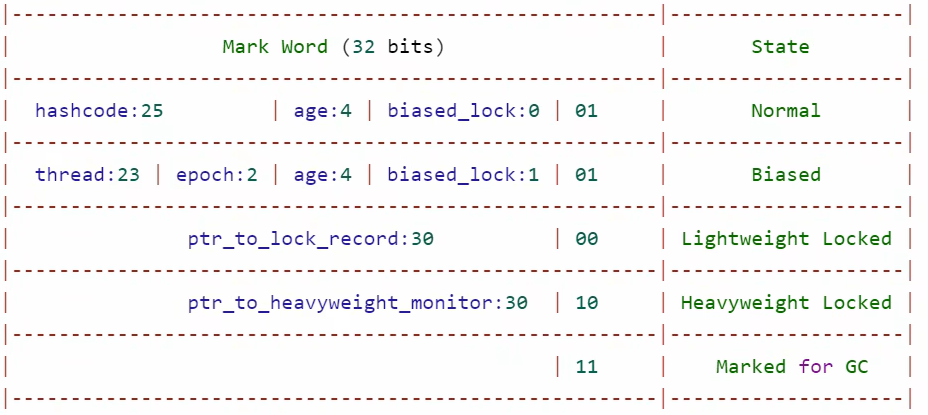
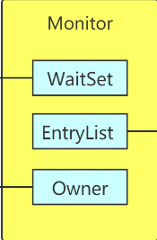

# Java对象头
  
  如果所示,在32位虚拟机下
  普通对象的对象头占据64个字节,其中Mark Word占据32字节,这个我们接下来会重点学习,Klass Word占据32字节,用于标识类相关信息;
  数组对象的对象头占据96个字节,除了Mark Word和Klass Word外,还有32个字节的array length;
  
  Mark Word结构:
  

# Monitor
  每个Java对象都可以关联一个Monitor对象,如果使用synchronized给对象上锁后,该对象头的mark word中就被设置指向monitor的指针(mark word中存了monitor的地址),
  
  owner      记录的是当前持有这个monitor的线程标识
  entryList  当前处于阻塞状态的等待获取锁的线程列表
  waitList   是

# 给对象加锁后的底层变化
  当代码中出现 synchronized(obj) 这样的代码时,表示我们给一个obj进行了加锁操作,这时在底层这个obj对象就跟一个monitor形成了关联,
obj的对象头中的mark word会记录下该monitor的地址,
  根据,我们不难发现,当我们尝试
用synchronized给对象加锁后,默认情况就是给对象添加了重量级锁,看此时的结构,重量级锁的mark word中的30个字节都用于记录monitor的地址,
剩余两个字节10,用来标识当前对象处于重量级锁锁定状态,这是对象头发生的变化;此时的monitor也会发生变化,monitor的owner会记录当前线程的
唯一标识,标识当前monitor(锁)已经被该线程抢占;这个过程中,monitor记录线程标识,而对象头中记录了monitor的地址,形成了对象持有锁的过程;
  上述的是单线程情况,如果此刻再来一个新线程,新线程也会去尝试获取锁,那monitor就会判断当前owner的线程标识和这个新线程的标识是否一致,
如果当前没有owner或者owner发现标识与新线程一致,那么新线程就可以成功获取锁,否则新线程就会进入等待状态,直到锁的owner释放了锁;这里进入
等待状态有讲究,新线程一定是要等待当前这个monitor的,所以二者也需要关联,新线程会与monitor中的EntryList(等待队列/阻塞队列)相关联;
  如果此时第三个线程来了,其实跟第二个线程一样,也会进行判断,当发现monitor已经被抢占后,会进入EntryList开始等待;
  一段时间后,当前持有的线程任务结束后,释放锁,那么此时EntryList中的线程会被唤醒去抢占锁,需要注意此时的竞争是非公平的(Synchronized
本身就是非公平锁)竞争成功的线程会将自己的标识存入owner,失败的线程则会重新回到EntryList准备下一次竞争;

