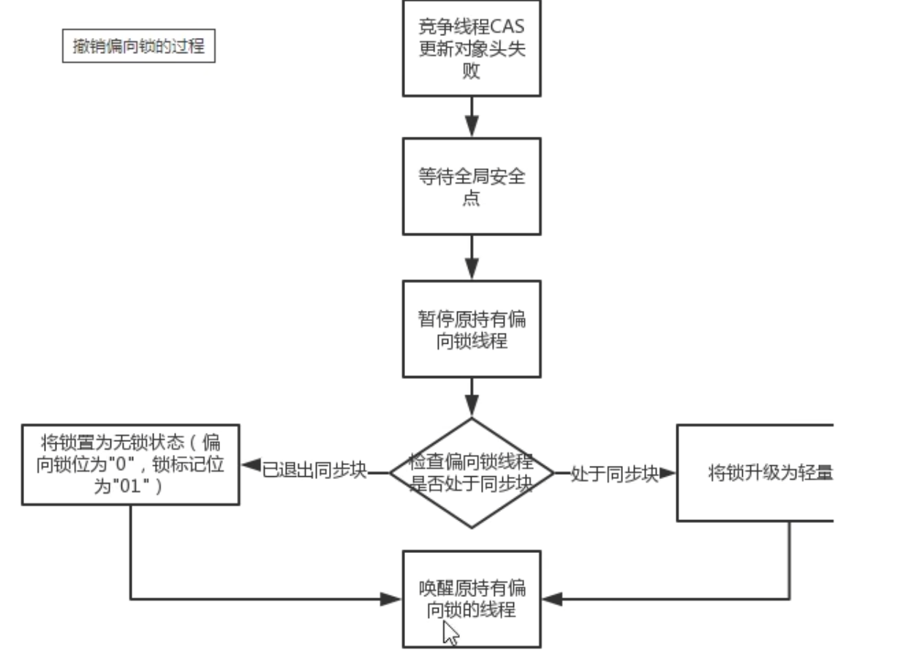
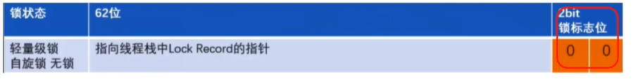

# 多线程访问情况
  - 只有一个线程来访问,有且唯一
  - 有多个线程(两个线程A、B交替访问)
  - 竞争激烈,更多个线程来访问

# synchronized锁的各个阶段对象头中mark word存储内容示意图
  
  - 偏向锁: MarkWord存储的是偏向的线程ID
  - 轻量锁: MarkWord存储的是指向线程栈中Lock Record(即栈帧)的指针
  - 重量锁: MarkWord存储的是指向堆中的monitor对象的指针

# 无锁
  这里需要注意无锁状态下的markword中的31位hashcode,默认情况下会是全0,因为hashcode()方法是懒加载,只有在对象调用了hashcode()这个
方法后,才会临时为对象生成一个hashcode值;

# 偏向锁
  - 偏向锁的适用场景: 只有一个线程访问同步代码块的场景; 

  - 偏向锁的作用:
    可以在只有一个线程执行同步时提高性能;当一段同步代码一直被同一个线程多次访问,由于只有一个线程,那么该线程在后续访问时便会自动获得锁,无需进行复杂的
  竞争判定和同步操作(即使释放锁以后,对象头的信息仍然会记录偏向线程的标识),提高了效率;  

  - 偏向锁的流程:
    一个线程首次持有锁,会将对象头中的偏向锁标志位改为1,然后会在对象的mark word中记录线程标识id,实现了持有锁,此时就是一个持有偏向锁的对象;
    后续这个线程进入和退出这段加了同步锁的代码块时,不需要再次加锁和释放锁,而是会去检查,当前对象的mark word中存放的是否是自己的线程id,
    - 如果相等: 表示偏向锁是偏向于当前线程的,就不需要再尝试获得锁了,直接进入同步;无需每次加锁解锁都去CAS更新对象头,如果自始至终使用锁的线程
             只有一个,很明显偏向锁几乎没有额外开销,性能极高;
    - 如果不等: 如果不等,发生竞争,又会有以下两种情况:
      - 竞争成功: 表示之前的线程不存在了,markword里面的线程id为新线程的线程id,锁不会升级,仍然为偏向锁,只是偏向的线程发生了变化
      - 竞争失败: 这时会升级为轻量级锁,才能保证线程间公平竞争锁
      注意: 偏向锁只有遇到其他线程尝试竞争偏向锁时,持有偏向锁的线程才会释放锁,线程是不会主动释放偏向锁的;

  - 偏向锁的撤销
    偏向锁使用一种等到竞争出现才释放锁的机制,只有当其他线程竞争锁时,持有偏向锁的原来线程才会被撤销;
    撤销需要等待全局安全点(该时间节点没有字节码执行),同时检查持有偏向锁的线程是否还在执行
    锁撤销的两种情况
     - 第一个线程正在执行synchronized方法(同步代码块),即持有锁,它还没有执行完,其他线程来抢夺,该偏向锁会被取消掉并出现锁升级,此时轻量级锁由原持有偏向锁的
     线程持有,继续执行同步代码块,而正在竞争的线程会进入自旋等待获取该轻量级锁
     - 第一个线程执行完synchronized方法(同步代码块),即已经释放锁,则将对象头设置为无锁状态并撤销偏向锁,重新偏向
     
     总结一下: 
       当一个线程持有偏向锁时,另一个线程来试图持有锁,那么就会发生锁升级,偏向锁升级为轻量级锁,仍然由原线程持有;
       当一个线程释放偏向锁时,另一个线程来试图持有锁,会发现当前对象已经偏向于第一个线程,则会撤销原来的偏向,转为重偏向于新来的线程;

  - 偏向锁和hashcode
    - 当一个对象计算过hashcode之后,那么该对象就无法被设置为偏向锁;[因为如果可以的话,设置偏向锁时,markword中的hashcode值必然会被偏向线程id给覆盖,
    ,既然覆盖了,若再次调用hashcode()时就需要重新生成,这就会造成同一个对象前后两次调用hashcode()方法的得到的结果不一致]
    - 当一个对象正处于偏向锁状态,又收到需要计算hashcode的请求时,它的偏向状态会被立即撤销,并且锁会膨胀为重量级锁;
    - 当一个对象已经计算过hashcode,就无法进入偏向锁状态,将跳过偏向锁,直接升级为轻量级锁
  - 经典白学
    java15以后逐步废弃偏向锁

# 轻量级锁
  - 概念: 多线程但并发量不高,即不存在锁竞争太过激烈的情况,也就没有线程阻塞
  - 主要目的: 在没有多线程竞争的前提下,通过自旋减少重量级锁使用操作系统互斥量产生的性能消耗,说白了先自旋,不行才升级阻塞
  - 轻量级锁产生的场景:
    - 就是我们上面介绍偏向锁时提到的,当一个线程持有偏向锁时,另一个线程来试图持有锁,那么就会发生锁升级,偏向锁升级为轻量级锁,仍然由原线程持有;
    - 如果关闭偏向锁,那在一个线程第一次持有锁时,该线程持有的就是轻量级锁;
  - 轻量级锁的加锁
      当一个线程持有轻量级锁后,会将对象头的markword中的内容复制存放在线程的栈帧中,然后对象头中markword被替换为指向线程栈中锁记录的指针;
      

  - 轻量级锁的优点
    竞争的线程不会阻塞,线程会通过自旋的方式进行锁竞争,提高了程序的响应速度

  - 轻量级锁的升级
    当一个线程自旋一定次数后仍没有成功获取锁时,会将该轻量级锁升级为重量级锁

# 自旋锁
  - 自适应自旋锁的大致原理
      线程如果自旋成功了,那下次自旋的最大次数会增加,因为JVM认为既然上次成功了,那么这一次也很大概率成功
      线程如果自旋失败了,那下次会减少自旋的次数甚至不自旋,避免CPU空转;

# 重量级锁
  [重量级锁的内容与](/notes/3.Monitor学习(BLK).md) 基本一致
  对象持有重量级锁时,对象头的markword中会记录一个指向monitor的指针,而在monitor中的owner则记录了当前持有锁的线程标识;

# synchronized锁升级后和hashcode的关系
  - 在无锁状态下,markword中可以存储对象的hashcode值,当对象的hashcode()方法第一次被调用时,JVM会生成对应的hashcode并将其存储到markword中;
  - 对于偏向锁,在线程获取偏向锁时,会用线程id和epoch覆盖hashcode所在的位置,如果一个对象的hashcode()方法已经被调用过一次之后,那么该对象就无法
  被设置为偏向锁,因为如果可以的话,那markword中的hashcode值必然会被偏向线程id给覆盖,这就会造成同一个对象前后两次调用hashcode()方法的得到的结果
  不一致;此外,当一个对象正处于偏向锁状态,又收到需要计算hashcode的请求时,它的偏向状态会被立即撤销,并且锁会膨胀为重量级锁;当一个对象已经计算过hashcode,
  就无法进入偏向锁状态,将跳过偏向锁,直接升级为轻量级锁
  - 升级为轻量级锁时,JVM会在当前线程的栈帧中创建一个锁记录,用于存储锁对象的markword拷贝,该拷贝中可以包含hashcode,所以轻量级锁可以和hashcode共存,
  释放锁以后,这些信息会被写回对象头
  - 升级为重量级锁后,markword保存指向monitor的地址指针,而分代年龄、hashcode和是否偏向锁这三块数据都会保存在monitor中,所以重量级锁可以和hashcode共存,
  释放锁以后,这些信息会被写回对象头

# JIT编译器对锁的优化
  - JIT: Just In Time Compiler  即时编译器
  - 锁消除: 锁消除指的是JIT编译器在编译过程中,通过静态分析和动态监测,检测到一些锁不必要时会将其消除,以减少不必要的同步开销,[锁消除案例](/src/main/java/syn/LockElimination.java)
  - 锁粗化: 锁粗化指的是JIT编译器在优化过程中,将多个连续的同步块合并为一个更大的同步块,从而减少同步的次数,提高性能和减少开销,[锁粗化案例](/src/main/java/syn/LockCoarsening.java)

