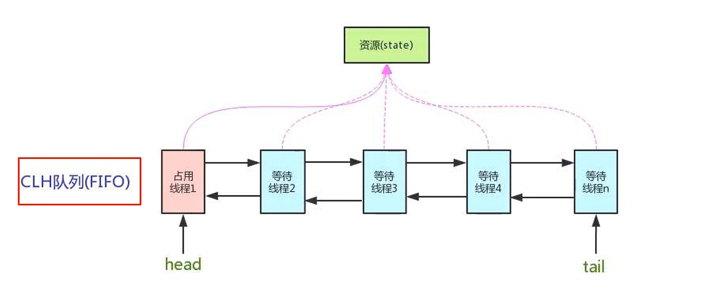
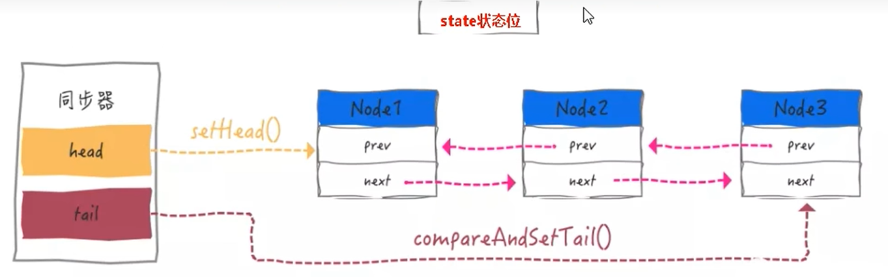

# AQS基本介绍
  AQS即AbstractQueuedSynchronizer,是一个抽象的队列同步器
  是用来实现锁或者其他同步器组件的公共基础部分的抽象实现,是重量级基础框架及整个JUC体系的基石,主要用于解决锁分配给谁的问题;
  核心思想是使用一个FIFO队列来管理获取锁和等待锁释放的线程,并提供了一种基于状态的机制来管理线程的竞争和争用;其内部使用的
逻辑是基于内部的一个状态state来控制同步操作的进行,这个state是AQS的核心概念;
  
# 理解锁和同步器的关系
  - 锁,面向于锁的使用者: 定义了程序员和锁交互的API,隐藏了实现细节,调用即可
  - 同步器,面向于锁的实现者: 
    提出了统一规范并简化了锁的实现,将其抽象出来,屏蔽了同步状态管理、同步队列的管理和维护、阻塞线程排队和通知、唤醒机制等,
  是一切锁和同步组件实现的————公共基础部分
  
# 多线程并发的排队等候机制
  如果共享资源被占用,就需要一定的阻塞等待唤醒机制来保证锁分配,这个机制主要应用的是CLH队列的变体实现的,将暂时获取不到锁的线程
加入到队列中,这个队列就是AQS同步队列的抽象表现;它将要请求共享资源的线程及自身的等待状态封装成队列的结点对象(Node),通过CAS、
自旋以及LockSupport.park()的方式,维护state变量的状态,使并发达到同步的效果;

# AQS源码说明
  AQS使用使用一个volatile的int类型的成员变量state来表示同步状态,通过内置的FIFO队列来完成资源获取的排队工作将每条要去抢占
资源的线程封装成一个Node节点来实现锁的分配,通过CAS完成对state值的修改;

# AQS源码中几个重要属性
  
  [属性学习](/src/main/java/aqs/AQSProperty.java)
  
# ReentrantLock底层应用AQS源码分析
  public final void acquire(int arg) {
    if (!tryAcquire(arg) &&
    acquireQueued(addWaiter(Node.EXCLUSIVE), arg))
    selfInterrupt();
  }   
  这个代码片段就是整个ReentrantLock底层AQS多线程获取锁的最核心的代码,一共三个方法,分别对应着不同的作用
  tryAcquire方法表示尝试加锁,每个进来的线程都会去尝试获取锁,这部分主要依赖于AQS的队列属性state,通过判断state的状态值0空闲,1已被持有来对线程能否持有锁进行逻辑判断;
  addWaiter方法用于处理未获取锁的线程进入阻塞队列,该阻塞队列的实现也是依赖于AQS的属性head和tail,我们会在该阻塞队列中设置一个虚拟节点以便后续的处理;
  acquireQueued方法用于将入队的线程置于阻塞状态,需要注意这些入队的线程会在acquireQueued方法中再次去尝试获取一次锁,一旦这次获取失败,就会进入在队列中进入阻塞状态,这里的阻塞是通过
LockSupport的park()实现的;

  后续当持有锁的线程执行任务结束,释放锁后,底层会去通过AQS的head属性获取head.next(),即拿到阻塞队列中最先入队的线程,LockSupport.unPark(thread)会按照入队顺序去将最先入队的线程唤醒;
  这里可以讲的点就比较多:
  - 首先是公平锁和非公平锁底层如何实现？ 
    easy,其实公平锁只比非公平锁多了一步,就是公平锁会先去阻塞队列里查看一下,有没有还在阻塞的线程,若有,队列中阻塞线程是优先的,且是按照入队顺序去获取锁;
    而非公平锁则是不会考虑阻塞队列的问题,直接去尝试获取锁;

  - 关于非公平锁
    即使是非公平锁也依然会按照阻塞队列的入队顺序去唤醒线程,那他之所以是非公平锁,是因为可能存在锁被未入队的新线程抢占的情况,因为非公平锁时,新线程不会考虑阻塞队列;
    但如果不考虑新线程涌入的情况,那么即使是非公平锁,也会按照阻塞队列的入队顺序唤醒线程;
    非公平锁不是完全不公平的,对于已经进入阻塞队列的线程,其实非公平锁也是公平的,会按照他们入队的顺序逐一唤醒;